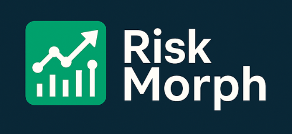

# RiskMorph – Credit Risk Prediction & Scoring System


**RiskMorph** is a machine learning-based credit risk classification system designed to assist loan officers in evaluating borrower default probabilities and creditworthiness. Using historical loan performance data, the model predicts credit risk levels and assigns a **scorecard-based credit rating**.

The project features an intuitive **Streamlit web app** that allows users to enter borrower and loan details, and instantly receive a credit decision based on model predictions.

---

## 🔍 Problem Statement

Credit risk assessment is a critical task in the lending industry. Traditional manual methods are often inconsistent and time-consuming. **RiskMorph** aims to automate this process using machine learning to:
- Predict the likelihood of **loan default**
- Computes the **credit score**
- Assign a **credit rating category** 

---

## 🧠 Model & Methodology

- **Type**: Supervised Classification
- **Data**: Historical loan records with default labels
- **Features**:
  - Borrower demographics
  - Loan details (amount, term, interest)
  - Bureau data (credit utilization, number of open accounts, etc.)
- **Output**:
  - `Default Probability` (e.g., 0.75 = 75% chance of default)
  - `Credit score` ranging from 300 to 900
  - `Credit Rating`: `Poor`, `Average`, `Good`, `Excellent`

---

## 🛠️ Tech Stack

- 🐍 **Python**
- 🤖 **Machine Learning**: scikit-learn, XGBoost, Logistic Regression
- 📊 **Data Analysis**: pandas, NumPy
- 🌐 **Frontend**: [Streamlit](https://streamlit.io)
- 📈 **Visualization**: matplotlib, seaborn

---

## 💡 App Features

- Easy-to-use form interface
- Real-time prediction on:
  - Default probability
  - Credit score
  - Credit score rating
- Scorecard logic aligned with credit bureau standards
- Responsive UI suitable for both analysts and credit officers

---

## 🚀 Getting Started

1. **Clone the repository:**
    ```commandline
   git clone https://github.com/RAWhulKerudi/riskmorph.git
   ```
2. **Install dependencies:**
    ```commandline
   pip install -r requirements.txt
   ```
3. **Run the Streamlit app:**
    ```commandline
   streamlit run main.py
   ```

---

## 📂 Project Structure

```
riskmorph/
│
├── artifacts/                   # Trained ML models
├── images/                      # UI samples & logos
├── main.py                      # Streamlit application
├── prediction_helper.py         # Prediction & scoring logic
├── README.md
└── requirements.txt 
```

---

## 📊 Example Output

> After entering borrower details:
```
Default Probability: 62.66%
Credit Score: 490
Rating: Poor
```

---

## 🌐 Project Links

- 🔗 GitHub Repo: [GitHub](https://github.com/RAWhulKerudi/riskmorph)
- 🚀 Live App: [Demo](https://riskmorph-credit-risk.streamlit.app/)

---


